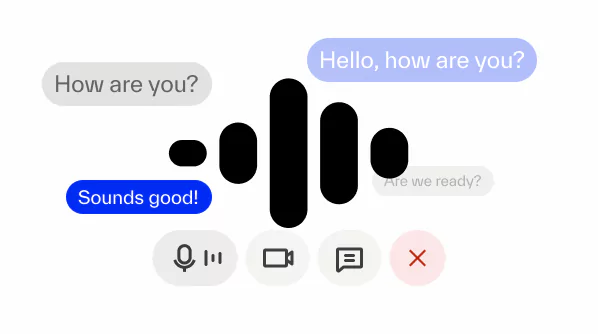

<div align="center">
  
  <h1>Local Voice AI</h1>
  <p>This project's goal is to enable anyone to easily build a powerful, private, local voice AI agent.</p>
  <p>A real-time voice AI assistant — STT, LLM, TTS — running in <strong>one container</strong>, supervised by a single Python parent process. Powered by <a href="https://docs.livekit.io/agents?utm_source=local-voice-ai">LiveKit Agents</a>.</p>
</div>

## Overview

Everything runs as managed children of one Python supervisor (`python -m local_voice_ai serve`):

- **LiveKit server** (Go binary subprocess) for WebRTC signaling — skipped if `LIVEKIT_URL` points at LiveKit Cloud.
- **llama.cpp** (`llama-server` binary subprocess) for the LLM — skipped if `LLAMA_BASE_URL` points elsewhere.
- **Nemotron STT** or **Whisper (vox-box)** — Python uvicorn child, OpenAI-compatible.
- **Kokoro TTS** — Python uvicorn child, OpenAI-compatible.
- **LiveKit Agents worker** — the orchestrator child.
- **FastAPI** in the supervisor itself, serving `POST /api/connection-details` (token minting) and the statically-exported Next.js frontend.

Children speak HTTP only over `127.0.0.1`. The image exposes three ports: `8080` (web), `7880`, `7881` (LiveKit WebRTC, only if running locally).

## Getting started

```bash
docker compose up --build
```

Open <http://localhost:8080> and click the start button.

The first build pulls upstream binaries (llama-server, livekit-server) and downloads the Nemotron + LLM weights on first request — expect tens of GB on first boot.

### GPU (NVIDIA)

```bash
LLAMA_IMAGE=ghcr.io/ggml-org/llama.cpp:server-cuda \
PYTHON_BASE=nvidia/cuda:12.4.1-runtime-ubuntu22.04 \
TORCH_INDEX_URL=https://download.pytorch.org/whl/cu124 \
LLAMA_N_GPU_LAYERS=35 \
docker compose up --build
```

### Apple Silicon

The CPU image works as-is. `llama-server` uses Metal automatically through its bundled binary.

## Swapping in cloud providers

Each service has a single "manage" decision driven by its base URL — point it at a remote endpoint and the local subprocess is skipped:

| Goal                              | Set                                                                                  |
| --------------------------------- | ------------------------------------------------------------------------------------ |
| Use LiveKit Cloud                 | `LIVEKIT_URL=wss://your-project.livekit.cloud` (+ `LIVEKIT_API_KEY` / `…_SECRET`)   |
| Use OpenAI for the LLM            | `LLAMA_BASE_URL=https://api.openai.com/v1`, `LLAMA_MODEL=gpt-4o-mini`, `LLAMA_API_KEY=sk-…` |
| Use a remote OpenAI-compatible STT| `STT_BASE_URL=…`, `STT_MODEL=…`, `STT_API_KEY=…`                                     |
| Use a remote OpenAI-compatible TTS| `TTS_BASE_URL=…`, `TTS_API_KEY=…`                                                    |

The supervisor logs which children it manages on startup.

## Local development (no Docker)

```bash
# Python side
uv pip install -e ".[ml,dev]"
python -m local_voice_ai serve

# Frontend side, in another shell (only needed if you're editing the UI)
cd frontend && pnpm install && pnpm run dev
```

## Architecture

```
┌──────────────────────── single container ────────────────────────┐
│  python -m local_voice_ai serve                                  │
│  │                                                                │
│  ├── child: livekit-server     (skipped if LIVEKIT_URL external) │
│  ├── child: llama-server       (skipped if LLAMA_BASE_URL ext.)  │
│  ├── child: nemotron | whisper (skipped if STT_BASE_URL ext.)    │
│  ├── child: kokoro             (skipped if TTS_BASE_URL ext.)    │
│  ├── child: livekit-agents worker                                │
│  └── in-process: FastAPI on :8080                                 │
│        ├── POST /api/connection-details  (token minting)         │
│        └── GET  /*                       (static frontend)       │
└───────────────────────────────────────────────────────────────────┘
```

## Project structure

```
.
├─ local_voice_ai/         # Python package: supervisor + agent + services
│  ├─ __main__.py          # python -m local_voice_ai serve
│  ├─ supervisor.py        # async process supervisor
│  ├─ config.py            # env-driven config + manage-X flags
│  ├─ api.py               # FastAPI: token route + static frontend
│  ├─ agent.py             # LiveKit Agents worker
│  └─ services/
│     ├─ nemotron/server.py
│     └─ kokoro/server.py
├─ frontend/               # Next.js (configured for static export)
├─ Dockerfile              # multi-stage build
├─ docker-compose.yml      # one service
└─ pyproject.toml          # one Python package, one venv
```

## Environment variables

See `.env` for the full list. The most important ones:

- `LIVEKIT_URL`, `LIVEKIT_API_KEY`, `LIVEKIT_API_SECRET` — local-default; override for cloud.
- `LLAMA_BASE_URL`, `LLAMA_MODEL`, `LLAMA_HF_REPO`, `LLAMA_N_GPU_LAYERS`
- `STT_PROVIDER` (`nemotron`|`whisper`), `STT_BASE_URL`, `STT_MODEL`
- `TTS_BASE_URL`, `TTS_VOICE`
- `WEB_PORT` (default `8080`)
- `MANAGE_LIVEKIT`, `MANAGE_LLAMA`, `MANAGE_STT`, `MANAGE_TTS` — explicit overrides for the auto-detected "is the URL external?" logic.

## Credits

- LiveKit: <https://livekit.io/>
- LiveKit Agents: <https://docs.livekit.io/agents/>
- NVIDIA Nemotron Speech: <https://huggingface.co/nvidia/nemotron-speech-streaming-en-0.6b>
- llama.cpp: <https://github.com/ggml-org/llama.cpp>
- Kokoro TTS: <https://github.com/hexgrad/kokoro>
- VoxBox (Whisper fallback): <https://pypi.org/project/vox-box/>
